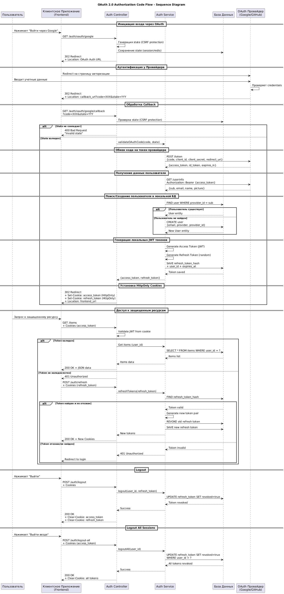

# Авторизация и аутентификация (JWT, OAuth2, Cookies)

### Цель работы
- Изучить различия между процессами аутентификации (Authentication) и авторизации (Authorization).
- Понять внутренние механизмы работы протоколов аутентификации без использования высокоуровневых библиотек-абстракций.
- Освоить принципы работы с токенами доступа (JWT) и механизмом обновления сессий (Refresh Tokens).
- Реализовать механизм безопасного хранения паролей (хеширование с использованием уникальной соли).
- Изучить протокол OAuth 2.0 и реализовать вход через сторонних провайдеров (на примере российских сервисов) вручную.
- Реализовать безопасную передачу токенов с использованием `HttpOnly` cookies.
- Реализовать серверское хранение Refresh токенов в базе данных для возможности управления сессиями (отзыв доступа).
- Закрепить навыки защиты эндпоинтов с помощью промежуточного ПО (Middleware/Guards).
- Изучить механизм Cross-Origin Resource Sharing (CORS) и настроить его для работы с клиентским приложением, размещенным на другом источнике.
- Дополнить документацию OpenAPI, созданную в работе [Проектирование и реализация RESTful API](../rest-api), схемами безопасности.
- Продолжить развитие архитектуры приложения, созданного в работе [Проектирование и реализация RESTful API](../rest-api), с соблюдением принципов модульности и безопасности.

### Технические требования
- Наличие интернет-соединения
- Наличие [cURL](https://curl.se/download.html) / [Postman](https://www.postman.com/downloads/) / [Insomnia](https://insomnia.rest/download)
- Наличие [Docker](https://docs.docker.com/desktop/) и [Docker Compose](https://docs.docker.com/compose/install/)
- Наличие настроенного окружения для работы с выбранным языком программирования (интерпретатор, компилятор, менеджер зависимостей [при необходимости])
- Наличие аккаунтов разработчика в системах OAuth-провайдеров (VK ID, Yandex ID или аналог) для получения ключей доступа.

### Технические ограничения
- СУБД: PostgreSQL (версия 16 или выше). Используется база данных из работы [Проектирование и реализация RESTful API](../rest-api).
- Архитектура: Модульная. Обязательное выделение модулей `Auth` и/или `Users`. Соблюдение разделения ответственности (Controller, Service, Repository/Model).
- Безопасность паролей:
    - Запрещено хранение паролей в открытом виде.
    - Обязательно использование алгоритмов хеширования (bcrypt, argon2 или аналогов).
    - Обязательно использование уникальной соли (salt) для каждого пароля.
- Запрет на использование готовых библиотек аутентификации:
    - Запрещено использовать высокоуровневые фреймворки для аутентификации (например, Passport.js, Spring Security OAuth, django-allauth, Laravel Socialite и аналоги).
    - Разрешено использовать криптографические библиотеки для работы с хешами и подписью JWT.
    - Разрешено использовать HTTP-библиотеки для запросов к OAuth-провайдерам.
- Токены и Cookies:
    - Access и Refresh токены должны передаваться клиенту исключительно через заголовок `Set-Cookie` с флагом `HttpOnly`.
    - Access и Refresh токены должны сохраняться в базе данных (в хешированном виде) для реализации механизма отзыва.
    - Access Token должен иметь короткое время жизни (рекомендуется 15 минут).
    - Refresh Token должен иметь длительное время жизни (рекомендуется 7 дней).
    - Время жизни обоих токенов задается переменными окружения и не должно быть захардкожено в коде.
- OAuth Провайдеры: Использовать российские сервисы (VK ID, Yandex ID и т.д.).
- CORS: Список разрешенных источников задается переменной окружения. Использование значения `*` запрещено, так как оно несовместимо с передачей учетных данных.
- Конфигурация: Все чувствительные данные (секреты, ключи API, подключения к БД) должны храниться в `.env` файле.
- Наследование: Данная работа является продолжением работы [Проектирование и реализация RESTful API](../rest-api). Существующий функционал (CRUD ресурсов, Soft Delete, Пагинация) должен оставаться работоспособным и быть защищенным авторизацией.

### Ход работы
В рамках данной работы необходимо интегрировать систему управления доступом в существующее приложение, реализуя ключевые механизмы безопасности вручную.

#### 1. Подготовка инфраструктуры (Docker)
Обновите конфигурацию `docker-compose.yml` при необходимости. Убедитесь, что переменные окружения для секретов JWT и OAuth добавлены в `.env` файл. Не добавляйте чувствительные данные в систему контроля версий.
Пример обновленного `docker-compose.yml` файла.

```bash
JWT_ACCESS_SECRET=super_secret_access_key_change_in_prod
JWT_REFRESH_SECRET=super_secret_refresh_key_change_in_prod
JWT_ACCESS_EXPIRATION=15m
JWT_REFRESH_EXPIRATION=7d

CLIENT_ID=your_client_id
CLIENT_SECRET=your_client_secret
CALLBACK_URL=http://localhost:4200/auth/yandex/callback

CORS_ORIGIN=http://localhost:5173
FRONTEND_URL=http://localhost:5173
```

Переменная `CORS_ORIGIN` задает источник клиентского приложения, которому разрешено обращаться к API (см. раздел 10). Переменная `FRONTEND_URL` используется для формирования адресов возврата: после обработки OAuth-callback и в ссылке на сброс пароля. На данном этапе клиентское приложение еще не разрабатывается, однако адреса не должны быть захардкожены в коде — это позволит подключить клиент в работе [Разработка клиентского приложения (SPA)](../spa-client) без изменения логики.

#### 2. Моделирование данных (Модуль Users и Auth)
Расширьте модель пользователя или создайте новую сущность для хранения учетных данных. Создайте отдельную сущность для хранения Access и Refresh токенов.

Требования к модели пользователя:
- Уникальный идентификатор.
- Поля для контактных данных (email или телефон).
- Поле для хеша пароля.
- Поле для соли.
- Поля для идентификации через OAuth (ID у провайдера). К примеру `yandex_id`, `vk_id`.
- Временные метки и поле для Soft Delete.

Требования к модели Access / Refresh Token:
- Связь с пользователем.
- Поле для хеша токена (не храните значение в открытом виде).
- Поле срока действия и флаг отзыва.

#### 3. Реализация хеширования и криптографии
Настройте использование библиотек для хеширования паролей и подписи JWT.
- Пароли: При регистрации и смене пароля используйте функцию хеширования, которая автоматически генерирует уникальную соль для каждого вызова. Это гарантирует, что одинаковые пароли разных пользователей будут иметь разные хеши в базе данных.
- Access / Refresh Token: При сохранении токенов в БД хешировать строку токена (рекомендуется также с использованием соли или алгоритмов одностороннего хеширования).
- JWT: При генерации JWT использовать секретные ключи из конфигурации.

#### 4. Реализация JWT и Cookies
Настройте механизм выдачи и проверки токенов без использования готовых стратегий аутентификации.
- Реализуйте логику генерации JWT (Access и Refresh).
- Реализуйте промежуточное ПО (Middleware/Guard) для извлечения токена из Cookies, проверки подписи и срока действия.
- Настройте установку Cookies с флагами безопасности (`HttpOnly`, `SameSite`).

Флаг `HttpOnly` делает cookie недоступной для чтения из JavaScript (`document.cookie`) и тем самым защищает токен при XSS-атаке. Атрибут `SameSite` определяет, приложит ли браузер cookie к запросу, инициированному с другого сайта:
-   `Lax` — cookie отправляется при переходе по ссылке, но не при фоновом межсайтовом запросе.
-   `Strict` — cookie не отправляется ни при каком переходе с другого сайта, что ломает возврат от OAuth-провайдера.
-   `None` — cookie отправляется всегда, но обязателен атрибут `Secure`, то есть работа по HTTPS.

Обратите внимание на различие понятий: `http://localhost:4200` и `http://localhost:5173` — это разные источники (origin), но один и тот же сайт (site). Поэтому при локальной разработке значения `Lax` достаточно, а при размещении клиента и API на разных доменах потребуется `None; Secure`.

#### 5. Реализация OAuth 2.0
Выберите российского провайдера (VK, Yandex). Зарегистрируйте приложение в консоли разработчика для получения Client ID и Client Secret. Реализуйте поток Authorization Code Grant вручную:
1.  Инициация: Формирование ссылки для редиректа пользователя на провайдера с параметром `state` (защита от CSRF).
2.  Callback: Обработка возврата от провайдера. Проверка `state`. Обмен кода авторизации на токен доступа провайдера. Получение данных пользователя.
3.  Локальная сессия: Поиск или создание пользователя в локальной БД. Генерация локальных JWT и установка Cookies.
4.  Возврат: Завершение обработки редиректом на адрес из переменной `FRONTEND_URL`, а не ответом в формате JSON. Клиентское приложение работает в браузере и должно получить управление обратно после установки cookies.

Обратите внимание: инициация потока (шаг 1) выполняется полной навигацией браузера по адресу `/auth/oauth/:provider`. Обращение к этому эндпоинту фоновым запросом невозможно — ответ является редиректом на внешний домен и будет заблокирован политикой источников.

#### 6. Создание DTO и Валидация
Разработайте объекты передачи данных (DTO) для входящих запросов и ответов.
- Валидация форматов email, телефона, сложности пароля.
- Валидация параметров пагинации (если применимо).
- Фильтрация чувствительных данных в ответах (не возвращать хеши, токены, внутренние ID провайдеров, соль).

#### 7. Реализация Контроллера и Эндпоинтов
Реализуйте следующие маршруты в контроллере авторизации:

| Метод | URI | Описание | Статус успеха | Доступ |
| :--- | :--- | :--- | :--- | :--- |
| POST | `/auth/register` | Регистрация нового пользователя | 201 Created | Public |
| POST | `/auth/login` | Вход (установка cookies) | 200 OK | Public |
| POST | `/auth/refresh` | Обновление пары токенов | 200 OK | Public (требуется valid Refresh Cookie) |
| GET | `/auth/whoami` | Проверка статуса и данные пользователя | 200 OK | Private |
| POST | `/auth/logout` | Завершение текущей сессии | 200 OK | Private |
| POST | `/auth/logout-all` | Завершение всех сессий пользователя | 200 OK | Private |
| GET | `/auth/oauth/:provider` | Инициация входа через OAuth | 302 Redirect | Public |
| GET | `/auth/oauth/:provider/callback` | Обработка ответа от OAuth провайдера | 302 Redirect | Public |
| POST | `/auth/forgot-password` | Запрос на сброс пароля | 200 OK | Public |
| POST | `/auth/reset-password` | Установка нового пароля | 200 OK | Public |

#### 8. Эндпоинт /whoami
Реализуйте эндпоинт для проверки статуса авторизации. Поскольку JavaScript на клиенте не имеет доступа к `HttpOnly` cookies, этот эндпоинт необходим фронтенду для понимания, авторизован ли пользователь.
- При успешной валидации токена возвращать профиль пользователя (без чувствительных данных).
- При отсутствии или невалидности токена возвращать соответствующий код ошибки (401).

#### 9. Защита существующих ресурсов
Вернитесь к модулям, созданным в работе [Проектирование и реализация RESTful API](../rest-api). Добавьте защиту на контроллеры или методы, отвечающие за CRUD операции с основным ресурсом предметной области.
- Доступ к ресурсам должен быть только у авторизованных пользователей.
- Реализуйте проверку владения ресурсом (пользователь может редактировать/удалять только свои записи).
- Исключите из проверки запросы методом `OPTIONS`. Браузер отправляет их автоматически перед основным запросом и без cookies, поэтому промежуточное ПО, применяемое ко всем маршрутам без исключений, ответит на такой запрос кодом `401` и сделает API недоступным для клиентского приложения. Подробнее — в разделе 10.

#### 10. Настройка CORS
Браузер по умолчанию запрещает JavaScript читать ответ на запрос к другому источнику (Same-Origin Policy). Источник — это сочетание схемы, хоста и порта, поэтому `http://localhost:5173` и `http://localhost:4200` являются разными источниками. Утилита cURL никакой политики источников не знает, и потому эти ограничения при консольном тестировании не проявляются.

Настройте механизм CORS в приложении:
-   Разрешенный источник читается из переменной окружения `CORS_ORIGIN`. Значение `*` использовать нельзя: браузер отвергает его в сочетании с передачей учетных данных.
-   Передача учетных данных (`credentials`) должна быть включена, иначе браузер не сохранит cookies из ответа и не приложит их к последующим запросам.
-   Разрешенные методы: `GET`, `POST`, `PUT`, `PATCH`, `DELETE`, `OPTIONS`. Разрешенный заголовок запроса: `Content-Type`.

Предварительный запрос (preflight): запрос с телом в формате JSON или методом `PUT`, `PATCH`, `DELETE` не считается простым. Перед ним браузер самостоятельно отправляет запрос `OPTIONS` на тот же адрес и выполняет основной запрос только при успешном ответе. Такой запрос отправляется без cookies и заголовков авторизации, поэтому обработка `OPTIONS` должна выполняться до проверки прав доступа.

Заголовки ответа, формирующие разрешение:

| Заголовок | Назначение |
| :--- | :--- |
| `Access-Control-Allow-Origin` | Источник, которому разрешено читать ответ |
| `Access-Control-Allow-Credentials` | Разрешение на передачу cookies |
| `Access-Control-Allow-Methods` | Разрешенные HTTP-методы (в ответе на preflight) |
| `Access-Control-Allow-Headers` | Разрешенные заголовки запроса (в ответе на preflight) |
| `Access-Control-Max-Age` | Время кеширования результата preflight браузером |

Документация по стекам: [NestJS](https://docs.nestjs.com/security/cors), [Spring Boot](https://docs.spring.io/spring-framework/reference/web/webmvc-cors.html), [Django](https://github.com/adamchainz/django-cors-headers), [FastAPI](https://fastapi.tiangolo.com/tutorial/cors/), [Gin](https://github.com/gin-contrib/cors), [Laravel](https://laravel.com/docs/routing#cors).

#### 11. Обработка ошибок и Безопасность
- Реализуйте глобальную обработку исключений. Не возвращайте технические детали ошибок клиенту.
- Возвращайте `401 Unauthorized` при проблемах с аутентификацией.
- Возвращайте `403 Forbidden` при недостатке прав.
- Реализуйте защиту от CSRF. При аутентификации через cookies она строится на трех механизмах: атрибут `SameSite` у cookies с токенами, проверка заголовка `Origin` у запросов, изменяющих состояние, и проверка параметра `state` в потоке OAuth.
- Убедитесь, что логи приложения не содержат паролей или полных токенов.
- Проверьте, что в базе данных невозможно восстановить исходный пароль из хеша даже при наличии доступа к БД (благодаря использованию соли).

#### 12. Документирование схем безопасности (OpenAPI)
Дополните спецификацию OpenAPI, созданную в работе [Проектирование и реализация RESTful API](../rest-api), описанием механизмов аутентификации.

1.  Схема безопасности: опишите используемый механизм как схему типа `apiKey` с расположением в cookie, указав имя cookie с access-токеном. Это позволит интерфейсу документации отображать защищенные эндпоинты как требующие авторизации.
2.  Поток OAuth 2.0: опишите в спецификации поток Authorization Code Grant с указанием адресов авторизации и обмена кода у выбранного провайдера, чтобы схема взаимодействия была видна в документации.
3.  Маркировка эндпоинтов: все маршруты с приватным доступом (`/auth/whoami`, `/auth/logout`, CRUD-операции над ресурсом предметной области) должны быть помечены как требующие авторизации и отображаться со значком замка.
4.  Ответы об ошибках: добавьте описание и примеры ответов `401 Unauthorized` и `403 Forbidden` для защищенных эндпоинтов.
5.  Фильтрация схем: убедитесь, что хеши паролей, соль, токены и внутренние идентификаторы провайдеров не попадают в схемы ответов, даже если присутствуют в модели данных. Используйте средства исключения полей, предоставляемые библиотекой.

Проверьте работу в интерфейсе документации: выполните `/auth/login`, убедитесь, что cookies установлены браузером, после чего вызовите `/auth/whoami` и защищенный CRUD-эндпоинт. Так как документация открывается с того же источника, что и API, cookies будут отправлены автоматически. Затем повторите запрос к защищенному эндпоинту без авторизации и убедитесь, что документация корректно отображает ответ `401`.

#### 13. Тестирование
Протестируйте все сценарии работы системы безопасности:
1.  Регистрация и вход
2.  Доступ к защищенному ресурсу без токена
3.  Доступ к защищенному ресурсу с токеном
4.  Истечение Access Token
5.  Завершение текущей сессии 
6.  Завершение всех сессий
7.  Вход через OAuth
8.  Проверка эндпоинта `/whoami` до и после входа
9.  Зарегистрируйте двух пользователей с одинаковым паролем. Убедитесь, что значения хешей паролей в базе данных отличаются (благодаря уникальной соли).
10. Проверьте настройку CORS. Отправьте запрос `OPTIONS` к защищенному эндпоинту и убедитесь, что он не требует авторизации, а в ответе присутствуют заголовки `Access-Control-Allow-Origin` и `Access-Control-Allow-Credentials`:
    ```bash
    curl -i -X OPTIONS http://localhost:4200/items \
      -H "Origin: http://localhost:5173" \
      -H "Access-Control-Request-Method: POST" \
      -H "Access-Control-Request-Headers: content-type"
    ```
    Значение заголовка `Access-Control-Allow-Origin` в ответе должно совпадать с переданным источником и не быть равным `*`.

### Критерии приемки
- Репозиторий: Код загружен на GitHub/GitLab.
- Документация: Файл `README.md` содержит:
    -   Краткое описание проекта.
    -   Пример файла переменных окружения (`.env.example`).
- Безопасность:
    - Пароли, Access и Refresh токены в БД захешированы с использованием соли.
    - Токены передаются только через `HttpOnly` cookies.
    - Не использованы готовые библиотеки аутентификации.
    - Реализована проверка параметра `state` в OAuth.
    - Настроен CORS: источник задается переменной окружения, не равен `*`, передача учетных данных включена.
    - Запросы методом `OPTIONS` не требуют авторизации.
- Функциональность:
    - Все указанные эндпоинты работают корректно.
    - Механизм Refresh Token реализован.
    - Logout и Logout-all инвалидируют токены в БД.
    - OAuth вход реализован вручную и работает, обработка callback завершается редиректом на адрес из `FRONTEND_URL`.
    - Ресурсы из работы [Проектирование и реализация RESTful API](../rest-api) защищены.
- Документация API:
    - Спецификация OpenAPI дополнена схемой безопасности, защищенные эндпоинты маркированы.
    - Описан поток OAuth 2.0.
    - Приведены примеры ответов `401` и `403`.
    - Чувствительные поля отсутствуют в схемах ответов.
- Код:
    - Соблюдена модульная структура.
    - Использованы DTO для данных.
    - Присутствует валидация входящих данных.
- Инфраструктура: Приложение запускается через `docker-compose up --build`.

### Контрольные вопросы
1.  В чем фундаментальная разница между аутентификацией и авторизацией?
2.  Что такое соль (salt) при хешировании пароля? Зачем она нужна и почему она должна быть уникальной для каждого пользователя?
3.  Из каких частей состоит JWT? Как сервер проверяет подлинность токена?
4.  Почему Refresh Token рекомендуется хранить в базе данных, а Access Token можно проверять Stateless?
5.  В чем преимущества использования `HttpOnly` cookies для хранения токенов по сравнению с `LocalStorage`?
6.  Зачем необходим эндпоинт `/whoami` при использовании `HttpOnly` cookies?
7.  Зачем нужен параметр `state` в OAuth 2.0 и какие риски возникают при его отсутствии?
8.  Опишите шаги потока Authorization Code Grant.
9.  В чем техническая разница между реализацией `/logout` и `/logout-all`?
10. Как реализовать защиту от CSRF атак при использовании OAuth?
11. Какие данные безопасно возвращать в ответе профиля пользователя, а какие категорически нельзя?
12. Что такое источник (origin)? Являются ли `http://localhost:4200` и `http://localhost:5173` одним источником и одним сайтом?
13. Какие запросы требуют предварительной проверки (preflight)? Почему запрос `OPTIONS` не должен требовать авторизации?
14. Почему при `Access-Control-Allow-Credentials: true` значение `Access-Control-Allow-Origin` не может быть равным `*`?
15. В чем разница между значениями `SameSite=Lax`, `Strict` и `None`? Почему `None` требует атрибута `Secure`?
16. Почему обработка OAuth-callback должна завершаться редиректом, а не ответом в формате JSON, если API используется браузерным клиентом?
17. Как документировать схему безопасности в OpenAPI, если приложение использует `HttpOnly` cookies?

### Рекомендуемая литература и документация
- OAuth 2.0: [RFC 6749](https://datatracker.ietf.org/doc/html/rfc6749), [Документация VK ID](https://id.vk.com/about/business/go/docs/ru/vkid/latest/vk-id/connection/realization), [Документация Yandex ID](https://yandex.ru/dev/id/doc/ru/register-api).
- JWT: [jwt.io](https://jwt.io/).
- Безопасность: [OWASP Authentication Cheat Sheet](https://cheatsheetseries.owasp.org/cheatsheets/Authentication_Cheat_Sheet.html), [OWASP Session Management](https://cheatsheetseries.owasp.org/cheatsheets/Session_Management_Cheat_Sheet.html), [OWASP Cookie Security](https://cheatsheetseries.owasp.org/cheatsheets/Cookie_Security_Cheat_Sheet.html), [OWASP Password Storage Cheat Sheet](https://cheatsheetseries.owasp.org/cheatsheets/Password_Storage_Cheat_Sheet.html).
- CORS: [MDN CORS](https://developer.mozilla.org/ru/docs/Web/HTTP/CORS), [MDN Preflight request](https://developer.mozilla.org/en-US/docs/Glossary/Preflight_request).
- Cookies: [MDN Set-Cookie](https://developer.mozilla.org/ru/docs/Web/HTTP/Headers/Set-Cookie), [MDN SameSite](https://developer.mozilla.org/ru/docs/Web/HTTP/Headers/Set-Cookie/SameSite).
- OpenAPI: [Authentication and Authorization](https://swagger.io/docs/specification/authentication/).
- HTTP: [Mozilla Developer Network (MDN)](https://developer.mozilla.org/).

###
