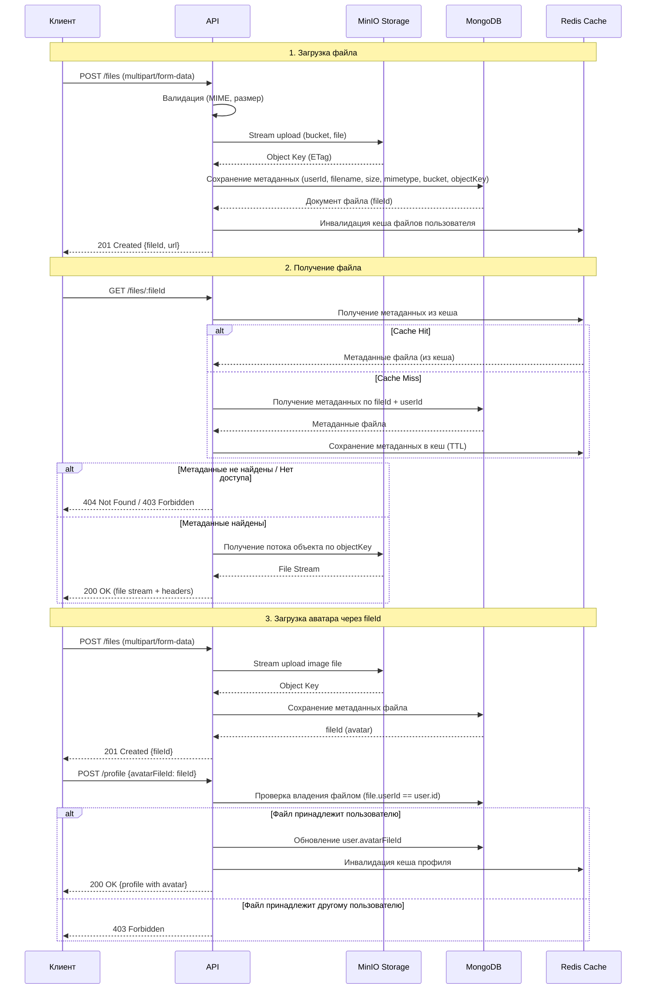

# Лабораторная работа №7
## Тема: Хранение файлов с использованием MinIO (Object Storage)

### Цель работы
- Изучить принципы работы с объектными хранилищами данных на примере MinIO.
- Освоить различия между хранением файлов в файловой системе, базе данных и объектном хранилище.
- Получить практические навыки подключения MinIO к веб-приложению.
- Реализовать загрузку и скачивание файлов с использованием потоков (Streams).
- Реализовать хранение метаданных файлов в базе данных с связью с пользователем.
- Интегрировать функционал загрузки аватара пользователя в профиль.
- Закрепить модульную архитектуру приложения, добавив слой работы с файлами.
- Обеспечить безопасность загружаемых файлов (валидация типов, размеров, доступ).

### Технические требования
- Наличие интернет-соединения.
- Наличие [cURL](https://curl.se/download.html) / [Postman](https://www.postman.com/downloads/) / [Insomnia](https://insomnia.rest/download).
- Наличие [Docker](https://docs.docker.com/desktop/) и [Docker Compose](https://docs.docker.com/compose/install/).
- Наличие настроенного окружения для работы с выбранным языком программирования (интерпретатор, компилятор, менеджер зависимостей).

### Технические ограничения
- Хранилище файлов: MinIO (версия latest). Запрещено хранение файлов в файловой системе приложения.
- Архитектура: Модульная. Обязательное выделение модуля `Storage` или аналогичного по функциональности. Соблюдение разделения ответственности (Controller, Service, Repository/Model).
- Запрещено хранение файлов в базе данных (BLOB).
- Обязательно хранение метаданных файла в БД (оригинальное имя, размер, mimetype, bucket, ключ объекта, владелец).
- Обязательная валидация типов файлов (MIME-type) и размеров при загрузке.
- Доступ к файлам должен быть авторизованным (пользователь может получать только свои файлы).
- Обязательное использование потоков (Streams) для обработки файлов.
- Запрещено полное буферизирование файла в памяти перед отправкой в MinIO.
- Конфигурация: Все чувствительные данные (ключи доступа MinIO, секреты, подключения) должны храниться в `.env` файле.
- Наследование: Данная работа является продолжением Лабораторных работ №2-№6. Все механизмы аутентификации, кеширования, документирования должны оставаться работоспособными.

### Краткие теоретические сведения

#### 1. Объектное хранилище (Object Storage)
Объектное хранилище — это система для хранения данных, где данные управляются как объекты (в отличие от файловой системы или базы данных). Каждый объект содержит:
- Данные (сам файл)
- Метаданные (информация о файле)
- Глобальный уникальный идентификатор

MinIO — высокопроизводительное совместимое с Amazon S3 объектное хранилище, которое можно развернуть локально.

#### 2. Потоки (Streams) vs Буферы (Buffers)
| Характеристика | Stream (Поток) | Buffer (Буфер) |
|---------------|----------------|----------------|
| Память | Обрабатывает данные частями, не загружая весь файл в память | Загружает весь файл в оперативную память |
| Производительность | Эффективно для больших файлов | Может вызвать OOM (Out Of Memory) для больших файлов |
| Время отклика | Может начать обработку до завершения загрузки | Должен дождаться полной загрузки |
| Использование | Рекомендуется для файлов > 1MB | Допустимо только для маленьких файлов |

#### 3. Схема загрузки файла в систему



### Ход работы

#### 1. Подготовка инфраструктуры (Docker)
Обновите конфигурацию `docker-compose.yml`, добавив сервис MinIO. Убедитесь, что переменные окружения для подключения добавлены в `.env` файл.

Пример обновленного `docker-compose.yml` (фрагмент инфраструктуры):
```yaml
version: "3.8"

services:
  # ...
  minio:
    image: minio/minio:latest
    container_name: wp_labs_minio
    restart: unless-stopped
    environment:
      MINIO_ROOT_USER: ${MINIO_ACCESS_KEY}
      MINIO_ROOT_PASSWORD: ${MINIO_SECRET_KEY}
    ports:
      - "9000:9000"   # API
      - "9001:9001"   # Console
    volumes:
      - wp_labs_minio:/data
    networks:
      - wp_labs_network
    command: server /data --console-address ":9001"
    healthcheck:
      test: ["CMD", "curl", "-f", "http://localhost:9000/minio/health/live"]
      interval: 10s
      timeout: 5s
      retries: 5

  app:
    build: .
    container_name: wp_labs_app
    restart: unless-stopped
    environment:
      
      # MinIO
      MINIO_ENDPOINT: minio:9000
      MINIO_ACCESS_KEY: ${MINIO_ACCESS_KEY}
      MINIO_SECRET_KEY: ${MINIO_SECRET_KEY}
      MINIO_BUCKET: ${MINIO_BUCKET}
      MINIO_USE_SSL: "false"
      MAX_FILE_SIZE: ${MAX_FILE_SIZE:-10485760}

    ports:
      - "4200:4200"
    depends_on:
      # ...
      minio:
        condition: service_healthy
    networks:
      - wp_labs_network

volumes:
  wp_labs_mongo:
  wp_labs_redis:
  wp_labs_minio:

  # ...
```

Пример `.env` файла
```
# MinIO
MINIO_ENDPOINT=minio:9000
MINIO_ACCESS_KEY=minio_admin
MINIO_SECRET_KEY=minio_secure_password_change_in_prod
MINIO_BUCKET=wp-labs-files
MINIO_USE_SSL=false
MAX_FILE_SIZE=10485760
```

#### 2. Моделирование данных (Модуль Storage)
Создайте новую сущность для хранения метаданных файлов.

Требования к модели File:
- Уникальный идентификатор (UUID).
- Связь с пользователем (userId).
- Оригинальное имя файла (originalName).
- Сохранённое имя/ключ объекта в MinIO (objectKey).
- Размер файла в байтах (size).
- MIME-тип файла (mimetype).
- Имя бакета (bucket).
- Временные метки (createdAt, updatedAt).
- Поле для Soft Delete (deletedAt).

#### 3. Модуль обновления профиля (Модуль Users/Profile)
Обновите модель пользователя, добавив поле для аватара.

Требования к обновлению модели User:
- Поле `avatarFileId` (UUID, nullable) — ссылка на файл аватара.
- При обновлении профиля пользователь может указать `fileId` для установки аватара.
- Система должна проверить, что файл принадлежит пользователю.
- При загрузке нового аватара предыдущий файл должен быть помечен как неиспользуемый (опционально — удалён).

#### 4. Реализация слоя работы с MinIO (Storage Service)
Создайте бакет (bucket) в [MinIO Console](http://localhost:9001/)
Создайте отдельный сервис для работы с MinIO.

Реализуйте методы:
- `uploadFile(stream, filename, mimetype, userId)` — загрузка файла с возвратом метаданных
- `getFileStream(objectKey)` — получение потока файла для скачивания
- `deleteFile(objectKey)` — удаление файла из хранилища
- `fileExists(objectKey)` — проверка существования файла

Используйте потоки для загрузки и скачивания файлов. Клиент MinIO должен инициализироваться с параметрами из переменных окружения. При загрузке файл не должен буферизироваться в памяти полностью.

#### 5. Валидация файлов
Реализуйте валидацию загружаемых файлов:

Требования к валидации:
- Максимальный размер файла: 10 MB (настраивается через `.env`).
- Разрешённые MIME-типы для аватара: `image/png`, `image/jpeg`, `image/jpg`.

Создайте DTO для загрузки файла с полем файла типа multipart/form-data. Создайте DTO для обновления профиля с опциональным полем avatarFileId типа UUID и другими полями профиля (displayName, bio).

#### 6. Создание Контроллера и Эндпоинтов
Реализуйте следующие маршруты в контроллере файлов:

| Метод | URI | Описание | Статус успеха | Доступ |
|-------|-----|----------|---------------|--------|
| POST | /files | Загрузка нового файла (multipart/form-data) | 201 Created | Доступно для авторизованных пользователей |
| GET | /files/:fileId | Скачивание файла по ID | 200 OK | Только владелец |
| DELETE | /files/:fileId | Удаление файла (Soft Delete + MinIO) | 204 No Content | Только владелец |
| POST | /profile | Обновление профиля (включая avatarFileId) | 200 OK | Только владелец |
| GET | /profile | Получение текущего профиля | 200 OK | Только владелец |

Контроллер файлов должен использовать декораторы для документации API, указывать возможные статусы ответов и потреблять multipart/form-data для загрузки. При скачивании файла необходимо устанавливать заголовки Content-Type, Content-Disposition и Content-Length.

Контроллер профиля должен позволять получение и обновление данных профиля текущего авторизованного пользователя.

#### 7. Интеграция с Swagger
Обновите документацию Swagger для новых эндпоинтов:

- Добавьте описание `multipart/form-data` для загрузки файлов.
- Укажите примеры ответов с информацией о файле.
- Добавьте соответствующие middlewares для защищённых эндпоинтов.
- Скройте чувствительные поля в ответах (objectKey, bucket).

Настройте Swagger UI для корректного отображения загрузки файлов через форму с полем типа binary.

#### 8. Кеширование метаданных файлов (Интеграция с Redis)
Используйте Redis для кеширования метаданных часто запрашиваемых файлов:

- Ключ: `wp:files:{fileId}:meta`
- TTL: 300 секунд
- Инвалидация при обновлении/удалении файла

При получении файла сначала проверяйте кеш метаданных, при отсутствии — загружайте из БД и сохраняйте в кеш. При изменении или удалении файла — удаляйте соответствующие ключи из кеша.

#### 9. Тестирование
Протестируйте все сценарии работы с файлами:

1. Загрузка файла: Используйте multipart/form-data запрос с файлом в теле запроса и заголовком авторизации.

2. Скачивание файла: Используйте GET запрос с ID файла и заголовком авторизации, сохраняйте ответ в файл.

3. Обновление профиля с аватаром: Сначала загрузите файл изображения, получите fileId из ответа, затем отправьте POST запрос на обновление профиля с указанием avatarFileId.

4. Проверка в MinIO: Откройте MinIO Console (http://localhost:9001), проверьте наличие файлов в бакете и метаданные объектов.

### Критерии приемки

- Репозиторий: Код загружен на GitHub/GitLab.
- Документация: Файл `README.md` содержит:
    - Краткое описание проекта.
    - Инструкция по запуску через `docker-compose up --build`.
    - Пример файла переменных окружения (`.env.example`).
    - Описание API (список эндпоинтов).

Функциональность:
- Загрузка файлов работает через потоки (не буфер).
- Метаданные файлов сохраняются в БД.
- Скачивание файлов работает с правильными заголовками.
- Удаление файлов помечает запись как удалённую и удаляет (опционально) из MinIO.
- Обновление профиля с аватаром работает корректно.
- Проверка владения файлом реализована.

Безопасность:
- Валидация MIME-типов и размеров файлов.
- Файлы не хранятся в БД или файловой системе приложения.
- Чувствительные данные в `.env`.

Код:
- Соблюдена модульная структура.
- Использованы DTO для данных.
- Присутствует валидация входящих данных.
- Логика работы с MinIO инкапсулирована в отдельном сервисе.
- Использованы потоки для обработки файлов.

### Контрольные вопросы

1. В чём фундаментальная разница между объектным хранилищем, файловой системой и базой данных для хранения файлов?
2. Что такое Bucket в MinIO/S3 и как он соотносится с папками в файловой системе?
3. Почему рекомендуется использовать потоки (Streams) вместо буферов (Buffers) для загрузки файлов? В чём техническая разница?
4. Какие риски возникают при хранении файлов в базе данных (BLOB) по сравнению с объектным хранилищем?
5. Зачем хранить метаданные файлов в отдельной таблице БД, а не полагаться только на метаданные MinIO?
6. Как обеспечить безопасность загружаемых файлов (валидация типов, антивирусная проверка)?
7. Что произойдёт, если файл будет загружен в MinIO, но запись в БД не удастся? Как обработать эту ситуацию?
8. Как реализовать публичный доступ к некоторым файлам и приватный к другим?
9. Какие стратегии инвалидации кеша следует применять для метаданных файлов?
10. Что такое Presigned URL и когда его следует использовать вместо проксирования файлов через API?
11. Как отличается обработка больших файлов (> 100MB) от маленьких в контексте потоковой загрузки?

### Рекомендуемая литература и документация

MinIO:
- [Официальная документация MinIO](https://min.io/docs/minio/linux/index.html)
- [MinIO Quickstart Guide](https://min.io/docs/minio/linux/operations/quickstart.html)
- [S3 API Compatibility](https://min.io/docs/minio/linux/operations/concepts/s3-compatibility.html)

Object Storage:
- [AWS S3 Documentation](https://docs.aws.amazon.com/s3/)

Streams:
- [Node.js Streams](https://nodejs.org/api/stream.html)
- [Understanding Streams in Node.js](https://nodesource.com/blog/understanding-streams-in-nodejs/)

Безопасность:
- [OWASP File Upload Security](https://cheatsheetseries.owasp.org/cheatsheets/File_Upload_Cheat_Sheet.html)
- [OWASP Unrestricted File Upload](https://owasp.org/www-community/vulnerabilities/Unrestricted_File_Upload)

Документация по SDK для допустимых стеков:
- TypeScript (NestJS): [minio-js](https://github.com/minio/minio-js)
- Java (Spring Boot): [MinIO Java SDK](https://github.com/minio/minio-java)
- Python: [minio-py](https://github.com/minio/minio-py)
- Go: [minio-go](https://github.com/minio/minio-go)
- PHP: [minio-php](https://github.com/minio/minio-php)