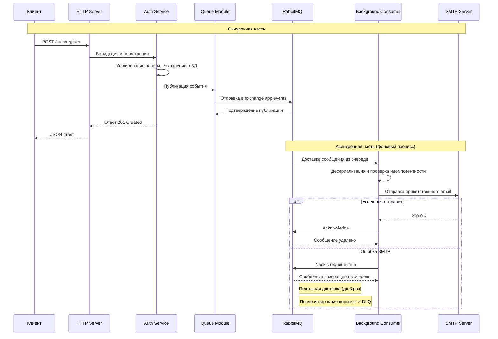

# Лабораторная работа №8
## Тема: Асинхронная обработка событий с использованием RabbitMQ

### Цель работы
- Изучить архитектурный паттерн «Производитель-Потребитель» и принципы работы брокеров сообщений
- Освоить базовые концепции RabbitMQ: exchanges, queues, bindings, routing keys
- Реализовать асинхронную обработку события регистрации пользователя с обязательной отправкой приветственного email
- Интегрировать RabbitMQ в модульную архитектуру монолитного приложения с соблюдением принципов разделения ответственности
- Освоить механизмы гарантированной доставки сообщений: подтверждения, повторные попытки, очередь мертвых сообщений
- Реализовать наблюдение за очередями и отладку асинхронных процессов через RabbitMQ Management UI

### Технические требования
- Наличие интернет-соединения.
- Наличие [cURL](https://curl.se/download.html) / [Postman](https://www.postman.com/downloads/) / [Insomnia](https://insomnia.rest/download).
- Наличие [Docker](https://docs.docker.com/desktop/) и [Docker Compose](https://docs.docker.com/compose/install/).
- Наличие настроенного окружения для работы с выбранным языком программирования (интерпретатор, компилятор, менеджер зависимостей).
- Наличие аккаунта в почтовом сервисе с поддержкой SMTP (Yandex, Gmail или аналог)

### Технический стек (на выбор студента)
- TypeScript: NestJS + `amqplib` или `@nestjs/bull`
- Java: Spring Boot + `Spring AMQP` / `RabbitTemplate`
- Python: FastAPI/Flask/Django + `pika` / `aio-pika`
- Go: Gin/Fiber + `github.com/rabbitmq/amqp091-go`
- PHP: Laravel + `php-amqplib` / `Laravel Queue`

### Технические ограничения
1. Брокер сообщений: RabbitMQ версии 3.12 или выше с Management Plugin
2. Архитектура:
   - Приложение развертывается как единый сервис (монолит). Отдельные микросервисы не создаются
   - Продюсер и консьюмер работают в рамках одного контейнера приложения. Потребитель инициализируется при старте приложения и работает в фоновом режиме (отдельный поток, воркер или интеграция в event loop)
3. Наследование: Работа выполняется на базе кода Лабораторных работ №2-№7. Все механизмы аутентификации, кеширования, документирования, работы с объектным хранилищем и Soft Delete должны оставаться работоспособными
4. Безопасность:
   - Подключение к RabbitMQ должно осуществляться с использованием логина и пароля (не `guest`/`guest`)
   - Чувствительные данные в сообщениях (пароли, токены, хеши) не должны передаваться в открытом виде
5. Конфигурация: Все параметры подключения к RabbitMQ и SMTP выносятся в `.env` файл
6. Гарантии доставки:
   - Обязательна отправка подтверждений (ack) после успешной обработки сообщения
   - Реализовать механизм повторной попытки (retry) при временных ошибках (минимум 3 попытки)
   - Настроить Dead Letter Queue для сообщений, которые не удалось обработать после максимального числа попыток
7. Сериализация: Сообщения передаются в формате JSON
8. Обязательная функциональность: При событии регистрации пользователя (`wp.auth.user.registered`) должна выполняться асинхронная отправка приветственного email через SMTP. Отправка email является обязательным требованием работы и не может быть заменена заглушками или логированием.

### Краткие теоретические сведения

#### 1. Брокеры сообщений и асинхронность
Брокер сообщений — промежуточное ПО, обеспечивающее надежную передачу данных между независимыми компонентами системы. В рамках монолитного приложения асинхронная обработка через брокер позволяет выносить тяжелые операции (отправка почты, генерация отчетов, обработка файлов) из синхронного HTTP-контекста, что сокращает время отклика API и повышает отказоустойчивость.

#### 2. Основные компоненты RabbitMQ

| Компонент | Описание |
|-----------|----------|
| Producer | Часть приложения, которая публикует сообщения в обменник |
| Consumer | Часть приложения, подписанная на очередь и обрабатывающая сообщения в фоновом режиме |
| Queue | Буфер, хранящий сообщения до момента их потребления |
| Exchange | Маршрутизатор, принимающий сообщения от producer и направляющий их в очереди согласно правилам |
| Binding | Связь между exchange и queue с опциональным routing key |
| Routing Key | Строка-идентификатор, используемая exchange для маршрутизации |

#### 3. Типы обменников (Exchanges)
- Direct: доставляет сообщение в очередь, где routing key точно совпадает с ключом привязки
- Fanout: рассылает сообщение во все привязанные очереди (игнорирует routing key)
- Topic: маршрутизирует по шаблону (например, `user.*` - все очереди, начинающиеся с `user.`)
- Headers: маршрутизация по заголовкам сообщения

#### 4. Гарантии доставки
- Persistent messages: сохранение сообщений на диск для защиты от перезапуска брокера
- Acknowledgements (ack): потребитель подтверждает обработку. Если подтверждение не получено или соединение разорвано, сообщение возвращается в очередь
- Dead Letter Exchange (DLX): механизм перенаправления сообщений, которые не удалось обработать или подтвердить, в специальную очередь для последующего анализа

#### 5. Именование и структура сообщений
В данной работе используется точечная нотация для именования сущностей RabbitMQ. Формат: `wp.module.action`.

```
# Очереди
wp.auth.user.registered
wp.auth.user.registered.dlq

# Сообщение (JSON)
{
  "eventId": "uuid",
  "eventType": "user.registered",
  "timestamp": "2026-04-11T10:30:00Z",
  "payload": {
    "userId": "uuid",
    "email": "user@example.com",
    "displayName": "User Name"
  },
  "metadata": {
    "attempt": 1,
    "sourceService": "auth-service"
  }
}
```

#### 6. Схема взаимодействия компонентов в рамках одного приложения



### Ход работы

#### 1. Подготовка инфраструктуры (Docker)
Обновите конфигурацию `docker-compose.yml`, добавив сервис RabbitMQ. Убедитесь, что переменные окружения для подключения добавлены в `.env` файл.

```yaml
version: "3.8"

services:
  rabbitmq:
    image: rabbitmq:3.12-management-alpine
    container_name: wp_labs_rabbitmq
    restart: unless-stopped
    environment:
      RABBITMQ_DEFAULT_USER: ${RABBITMQ_USER}
      RABBITMQ_DEFAULT_PASS: ${RABBITMQ_PASS}
    ports:
      - "5672:5672"
      - "15672:15672"
    volumes:
      - wp_labs_rabbitmq:/var/lib/rabbitmq
    networks:
      - wp_labs_network
    healthcheck:
      test: ["CMD", "rabbitmq-diagnostics", "-q", "ping"]
      interval: 10s
      timeout: 5s
      retries: 5

  app:
    build: .
    container_name: wp_labs_app
    restart: unless-stopped
    environment:
      RABBITMQ_HOST: rabbitmq
      RABBITMQ_PORT: 5672
      RABBITMQ_USER: ${RABBITMQ_USER}
      RABBITMQ_PASS: ${RABBITMQ_PASS}
      SMTP_HOST: ${SMTP_HOST}
      SMTP_PORT: ${SMTP_PORT}
      SMTP_USER: ${SMTP_USER}
      SMTP_PASS: ${SMTP_PASS}
      SMTP_FROM: ${SMTP_FROM}
      # Остальные переменные окружения из предыдущих работ
    depends_on:
      rabbitmq:
        condition: service_healthy
    networks:
      - wp_labs_network
    # Команда запуска должна инициировать HTTP-сервер и фоновый консьюмер

volumes:
  wp_labs_rabbitmq:

networks:
  wp_labs_network:
```

Обновите файл `.env`:
```env
# RabbitMQ
RABBITMQ_USER=student
RABBITMQ_PASS=student_secure_rabbit_pass_change_in_prod

# Имена очередей (точечная нотация)
QUEUE_USER_REGISTERED=wp.auth.user.registered

# SMTP конфигурация
SMTP_HOST=smtp.yandex.ru
SMTP_PORT=465
SMTP_USER=your_email@yandex.ru
SMTP_PASS=your_app_password
SMTP_FROM=your_email@yandex.ru
SMTP_SECURE=true
```

Откройте RabbitMQ Management UI: `http://localhost:15672`. Авторизуйтесь с использованием данных из `.env`.

#### 2. Проектирование модуля работы с очередями
Создайте отдельный модуль для работы с RabbitMQ (например, `src/common/queue/`). Реализуйте сервис-абстракцию с методами:
- `publish(exchange: string, routingKey: string, payload: object, options?: PublishOptions): Promise<void>`
- `consume(queue: string, handler: (message: object) => Promise<void>): Promise<void>`
- `ack(message: Message): void` / `nack(message: Message, requeue: boolean): void`

Настройте подключение к RabbitMQ с использованием переменных окружения. Настройте сериализацию/десериализацию сообщений в JSON. Обеспечьте инициализацию консьюмера при старте приложения (в том же процессе, что и HTTP-сервер).

#### 3. Реализация Producer (публикация событий)
Модифицируйте сервис регистрации пользователя для публикации события при успешной регистрации:

| Событие | Триггер | Обменник | Routing Key | Очередь |
|---------|---------|----------|-------------|---------|
| `user.registered` | Успешная регистрация (`POST /auth/register`) | `app.events` | `user.registered` | `wp.auth.user.registered` |

Требования к публикации:
- Используйте Direct Exchange с именем `app.events`
- Сообщения должны содержать: `eventId` (UUID), `eventType`, `timestamp`, `payload` (данные без паролей/токенов), `metadata`
- Включите постоянство сообщений (`persistent: true`) для защиты от потери при перезапуске брокера
- Логируйте факт отправки сообщения (без содержимого чувствительных данных)

#### 4. Реализация Consumer и отправка email
Создайте обработчик для очереди `wp.auth.user.registered`. Реализуйте логику отправки приветственного email:
- Используйте SMTP-протокол для отправки писем
- Настройте подключение к почтовому сервису через переменные окружения
- Реализуйте шаблон письма с приветствием и информацией об аккаунте

Реализуйте механизм подтверждений (ack):
- Подтверждайте сообщение только после успешной отправки email
- При ошибке SMTP используйте `nack` с `requeue: true` для повторной попытки
- Отслеживайте количество попыток через поле `metadata.attempt`
- После исчерпания попыток (3) перенаправляйте сообщение в Dead Letter Queue

Обеспечьте идемпотентность обработки:
- Используйте `eventId` для предотвращения повторной обработки одного и того же события
- Храните обработанные `eventId` в Redis с TTL 24 часа или в отдельной таблице БД

Пример структуры обработчика (псевдокод):
```typescript
async handleUserRegistered(message: RabbitMQMessage) {
  const { eventId, payload, metadata } = message.content;
  
  if (await this.isEventProcessed(eventId)) {
    return this.ack(message);
  }
  
  try {
    await this.emailService.sendWelcomeEmail({
      to: payload.email,
      displayName: payload.displayName,
      userId: payload.userId
    });
    
    await this.markEventAsProcessed(eventId);
    this.ack(message);
  } catch (error) {
    if (metadata.attempt >= 3) {
      this.nack(message, false);
      this.logger.error(`Message ${eventId} sent to DLQ`);
    } else {
      this.nack(message, true);
      this.logger.warn(`Retry attempt ${metadata.attempt + 1} for event ${eventId}`);
    }
  }
}
```

#### 5. Настройка очередей и обменников
При старте приложения выполните декларацию сущностей RabbitMQ:

```typescript
// Псевдокод инициализации
await channel.assertExchange('app.events', 'direct', { durable: true });

await channel.assertQueue('wp.auth.user.registered', {
  durable: true,
  deadLetterExchange: 'app.dlx',
  deadLetterRoutingKey: 'user.registered'
});

await channel.bindQueue('wp.auth.user.registered', 'app.events', 'user.registered');

await channel.assertExchange('app.dlx', 'direct', { durable: true });
await channel.assertQueue('wp.auth.user.registered.dlq', { durable: true });
await channel.bindQueue('wp.auth.user.registered.dlq', 'app.dlx', 'user.registered');
```

Убедитесь, что все сущности объявлены как `durable` (сохраняются после перезапуска RabbitMQ).

#### 6. Тестирование и отладка
1. Запустите приложение: `docker-compose up --build`.
2. Протестируйте публикацию событий:
   - Выполните `POST /auth/register` с новыми данными пользователя
   - В логах приложения убедитесь, что событие опубликовано в очередь
   - В RabbitMQ Management UI / Queues проверьте появление сообщения в очереди `wp.auth.user.registered`
3. Протестируйте потребление и отправку email:
   - Убедитесь, что фоновый обработчик получил сообщение и выполнил отправку письма
   - Проверьте почтовый ящик на наличие приветственного письма
   - В Management UI убедитесь, что очередь пуста (сообщение обработано и подтверждено)
4. Протестируйте отказоустойчивость:
   - Остановите фоновый обработчик (если реализован как отдельный процесс) или эмулируйте недоступность SMTP
   - Выполните несколько запросов регистрации
   - Убедитесь, что сообщения накапливаются в очереди
   - Восстановите работоспособность — сообщения должны быть обработаны
5. Протестируйте механизм повторных попыток:
   - Намеренно укажите неверные SMTP-credentials
   - Убедитесь, что сообщение возвращается в очередь и обрабатывается повторно
   - После 3 неудачных попыток проверьте, что сообщение попало в очередь `wp.auth.user.registered.dlq`
6. Проверьте идемпотентность:
   - Отправьте одно и то же событие дважды (с одинаковым `eventId`)
   - Убедитесь, что приветственное письмо отправлено только один раз

#### 7. Дополнительные требования
1. Логирование: Логируйте все этапы обработки сообщения: получение, попытку отправки, успех/ошибку. Не логируйте содержимое чувствительных полей.
2. Конфигурация SMTP: Реализуйте валидацию конфигурации SMTP при старте приложения. При отсутствии обязательных переменных окружения приложение должно завершаться с понятной ошибкой.
3. Шаблон письма: Приветственное письмо должно содержать: обращение по имени, подтверждение регистрации, ссылку на вход в систему. Поддержите как plain text, так и HTML-версию письма.
4. Обработка ошибок: Реализуйте глобальный обработчик ошибок для consumer. При критических ошибках (невозможность подключения к RabbitMQ) приложение должно перезапускаться.

### Критерии приемки

Репозиторий: Код загружен на GitHub, присутствует `.gitignore`.

Документация (`README.md`):
- Краткое описание архитектуры и схемы взаимодействия с RabbitMQ
- Пример `.env.example` с переменными для RabbitMQ и SMTP
- Инструкция по запуску: `docker-compose up --build`
- Описание реализованных очередей и событий

Инфраструктура:
- `docker-compose.yml` содержит сервис RabbitMQ с Management Plugin
- Приложение успешно подключается к RabbitMQ с использованием учетных данных из `.env`
- Healthcheck для RabbitMQ настроен и работает

Функциональность:
- Событие `user.registered` публикуется в очередь при успешной регистрации
- Потребитель корректно обрабатывает сообщения и отправляет приветственный email
- Реализован механизм повторных попыток при ошибках SMTP (минимум 3 попытки)
- Сообщения сохраняются при перезапуске RabbitMQ (persistent + durable)
- Неудачные сообщения после исчерпания попыток попадают в Dead Letter Queue

Безопасность и качество:
- В сообщениях не передаются пароли, хеши, полные токены
- Подключение к RabbitMQ защищено паролем (не `guest`)
- Использованы префиксы для имен очередей и обменников (точечная нотация)
- Реализована идемпотентность обработки через `eventId`
- SMTP-credentials не логируются и не передаются в сообщениях

Код:
- Логика работы с очередями инкапсулирована в отдельном модуле
- Продюсер и консьюмер работают в рамках одного контейнера приложения
- Присутствует валидация входящих данных перед публикацией события
- Обработчик consumer реализует ack/nack логику
- Все предыдущие функциональные блоки (ЛР №2-№7) остаются работоспособными

Тестирование:
- В `README` приведены примеры cURL-запросов для проверки публикации событий
- Описаны шаги проверки через RabbitMQ Management UI
- Предоставлены скриншоты или логи, подтверждающие отправку email

### Контрольные вопросы

1. В чем принципиальная разница между синхронным HTTP-запросом и асинхронной отправкой сообщения в очередь?
2. Что такое обменник (exchange) в RabbitMQ? Чем тип `direct` отличается от `fanout` и `topic`?
3. Зачем нужны подтверждения (acknowledgements) и что произойдет, если потребитель упадет до отправки ack?
4. Что такое Dead Letter Queue и в каких сценариях ее использование оправдано?
5. Почему важно обеспечивать идемпотентность обработчиков сообщений? Как это реализовать на практике?
6. Какие данные нельзя передавать в сообщениях очереди и почему?
7. Как обеспечить надежность доставки сообщений при перезапуске брокера или потребителя?
8. В чем преимущества и недостатки использования брокера сообщений по сравнению с прямыми вызовами между сервисами?

### Рекомендуемая литература и документация

- RabbitMQ Official Tutorials: https://www.rabbitmq.com/getstarted.html
- RabbitMQ Management Plugin: https://www.rabbitmq.com/management.html
- AMQP 0.9.1 Model Explained: https://www.rabbitmq.com/tutorials/amqp-concepts.html
- Patterns: Enterprise Integration Patterns: https://www.enterpriseintegrationpatterns.com/ (раздел Messaging)
- Документация по клиентским библиотекам:
  - NestJS: https://docs.nestjs.com/techniques/queues, https://amqp-node.github.io/amqplib/
  - Spring Boot: https://docs.spring.io/spring-amqp/reference/html/
  - Python: https://pika.readthedocs.io/, https://aio-pika.readthedocs.io/
  - Go: https://pkg.go.dev/github.com/rabbitmq/amqp091-go
  - Laravel: https://laravel.com/docs/queues
- OWASP: Secure Messaging: https://cheatsheetseries.owasp.org/cheatsheets/Message_Protection_Cheat_Sheet.html


Примечание: В рамках данной работы потребитель реализуется как фоновый процесс или интеграция в жизненный цикл основного приложения. Отдельные микросервисы не разворачиваются. Главное требование — соблюдение контракта сообщений, гарантированная доставка и асинхронная отправка email.