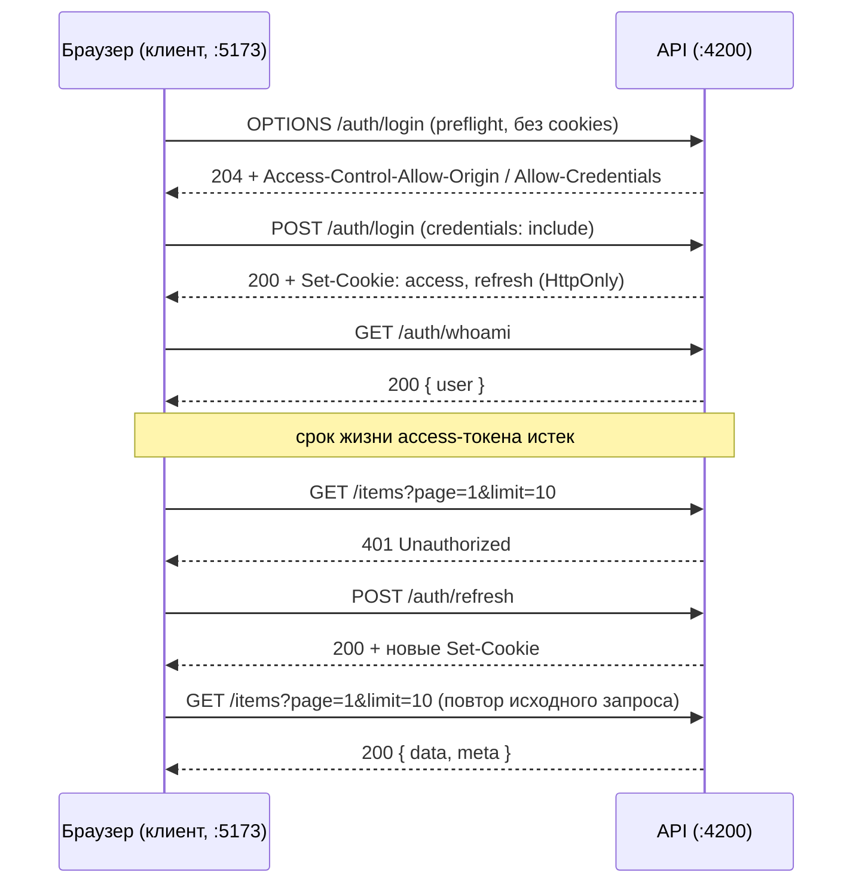

# Разработка клиентского приложения (SPA) для взаимодействия с REST API

### Цель работы
- Изучить архитектуру одностраничного приложения (SPA) и принципы его взаимодействия с REST API.
- Закрепить понимание механизма CORS и предварительных запросов (preflight) со стороны клиента.
- Понять, каким образом клиентское приложение работает с сессией, если токены недоступны из JavaScript.
- Реализовать полный клиентский цикл аутентификации: вход, определение состояния сессии, автоматическое обновление токенов, выход.
- Реализовать потребление контракта API: пагинацию, обработку ошибок валидации, коды состояния.
- Освоить инициацию потока OAuth 2.0 из браузера и возврат пользователя в клиентское приложение.
- Реализовать загрузку и отображение медиафайлов, размещенных в объектном хранилище.
- Закрепить навыки контейнеризации: собрать статику клиента в отдельный образ с веб-сервером и подключить его в общий `docker-compose.yml`.
- Освоить диагностику сетевого взаимодействия средствами инструментов разработчика браузера.

### Технические требования
- Наличие интернет-соединения.
- Наличие [Node.js](https://nodejs.org/) версии 20 или выше (требуется только для сборки клиента и не влияет на язык серверного приложения).
- Наличие браузера с инструментами разработчика (вкладка Network обязательна).
- Наличие [Docker](https://docs.docker.com/desktop/) и [Docker Compose](https://docs.docker.com/compose/install/).
- Рабочая версия приложения, созданного в предшествующих работах курса.

### Технический стек (на выбор студента)
- Сборщик: [Vite](https://vite.dev/). Язык: TypeScript.
- Фреймворк: [React](https://react.dev/) с [React Router](https://reactrouter.com/) либо [Vue](https://vuejs.org/) с [Vue Router](https://router.vuejs.org/).
- Библиотека компонентов (обязательна, на выбор):
    - React: [MUI](https://mui.com/), [Mantine](https://mantine.dev/), [Ant Design](https://ant.design/).
    - Vue: [Vuetify](https://vuetifyjs.com/), [PrimeVue](https://primevue.org/), [Element Plus](https://element-plus.org/).

### Технические ограничения
- Архитектура клиента: одностраничное приложение, работающее в браузере и обращающееся к API по HTTP. Запрещено использование мета-фреймворков с серверным рендерингом ([Next.js](https://nextjs.org/), [Nuxt](https://nuxt.com/), Remix и аналогов): при серверном рендеринге запросы к API выполняются не браузером, механизмы CORS и cookies перестают проявляться, и предмет изучения данной работы теряется.
- Шаблонизаторы серверного фреймворка (Blade, Jinja, Thymeleaf, Twig) в качестве клиентского приложения не принимаются.
- Хранение токенов: запрещено использование `localStorage`, `sessionStorage` и cookies без флага `HttpOnly` для хранения access и refresh токенов. Аутентификация выполняется исключительно на механизме cookies, реализованном в работе [Авторизация и аутентификация](../auth).
- Адрес API: задается переменной окружения на этапе сборки. Хардкод адреса в исходном коде запрещен.
- Оформление: обязательно использование библиотеки компонентов из списка выше. Объем собственных правил CSS — не более 50 строк на весь проект.
- Внешний вид, цветовая схема, типографика и адаптивность не оцениваются. Оценивается наблюдаемое сетевое поведение приложения и корректность работы с API.
- Размещение: код клиента находится в отдельной директории репозитория (например, `client/`) либо в отдельном репозитории, указанном в `README.md`.
- Наследование: серверное приложение, созданное в предшествующих работах курса, изменяется только в объеме, необходимом для устранения несоответствий, выявленных при подключении клиента. Вся существующая функциональность должна оставаться работоспособной.
- Библиотеки управления состоянием (Redux, Zustand, Pinia, MobX) и клиентские тестовые фреймворки допускаются, но не требуются и не оцениваются.

### Краткие теоретические сведения

#### 1. Одностраничное приложение (SPA)
Одностраничное приложение — это клиент, который загружается браузером один раз в виде статических файлов (HTML, JavaScript, CSS) и далее самостоятельно перерисовывает интерфейс, получая данные от API в фоновых запросах. Навигация между разделами выполняется клиентским маршрутизатором без перезагрузки страницы.

Из этого следует два практических вывода, определяющих ход данной работы:
- Клиент и API — разные приложения, размещенные на разных источниках, поэтому обязателен механизм CORS.
- Веб-сервер, раздающий статику клиента, ничего не знает о клиентских маршрутах. При прямом открытии адреса `/items/42` или перезагрузке страницы он будет искать соответствующий файл на диске и вернет `404 Not Found`, если не настроен на возврат `index.html` для всех неизвестных путей.

#### 2. Источник и политика источников
Источник (origin) — это сочетание схемы, хоста и порта. Адреса `http://localhost:5173` и `http://localhost:4200` относятся к разным источникам, поэтому браузер по умолчанию запрещает клиентскому JavaScript читать ответ API. Обратите внимание: сам запрос при этом чаще всего доходит до сервера и обрабатывается им — блокируется именно чтение ответа скриптом. Механизм CORS, настроенный в работе [Авторизация и аутентификация](../auth), снимает этот запрет для указанного источника.

Утилита cURL политики источников не знает и предварительных запросов не отправляет, поэтому все ошибки данного класса проявляются только в браузере.

#### 3. Состояние сессии при использовании HttpOnly cookies
Токены, установленные с флагом `HttpOnly`, недоступны из `document.cookie`. Клиентское приложение не может прочитать токен, разобрать его содержимое или проверить срок действия. Единственный доступный способ определить, авторизован ли пользователь, — обратиться к эндпоинту `/auth/whoami`, реализованному в работе [Авторизация и аутентификация](../auth), и интерпретировать код ответа.

Отсюда следует порядок запуска приложения: до получения ответа от `/auth/whoami` клиент находится в состоянии загрузки и не должен показывать ни форму входа, ни защищенное содержимое.

#### 4. Схема взаимодействия клиента и API



### Ход работы
В рамках данной работы необходимо разработать клиентское приложение, потребляющее API, созданное в предшествующих работах курса, и собрать его в отдельный Docker-образ. Развертывание клиента в кластере выполняется в следующей работе [Масштабирование веб-приложений на примере Kubernetes](../kubernetes).

#### 1. Создание проекта клиента
Создайте проект с использованием Vite и выбранного фреймворка, подключите библиотеку компонентов и маршрутизатор. Реализуйте как минимум следующие маршруты:

| Маршрут | Назначение | Доступ |
| :--- | :--- | :--- |
| `/login` | Форма входа | Публичный |
| `/register` | Форма регистрации | Публичный |
| `/items` | Список ресурса предметной области | Приватный |
| `/items/:id` | Просмотр и редактирование элемента | Приватный |
| `/profile` | Профиль пользователя, аватар, список файлов | Приватный |

Замените `/items` на ресурс вашей предметной области, как и в работе [Проектирование и реализация RESTful API](../rest-api).

Адрес API вынесите в переменную окружения. Создайте файлы `.env` и `.env.example`:
```env
VITE_API_URL=http://localhost:4200
```

Клиент должен запускаться на порту, отличном от порта API (Vite использует `5173` по умолчанию). Это принципиально: разные источники и являются предметом изучения данной работы.

#### 2. Слой доступа к API
Реализуйте единую обертку над `fetch` (или над HTTP-клиентом), через которую проходят все запросы приложения. Требования:
- Базовый адрес читается из переменной окружения.
- Во все запросы передается режим отправки учетных данных (`credentials: 'include'` для `fetch`). Без этого параметра браузер не приложит cookies к запросу и не сохранит cookies из ответа, и вся аутентификация окажется неработоспособной.
- Ответы с кодами `4xx` и `5xx` преобразуются в объект ошибки приложения, при этом тело ответа с перечнем ошибок валидации (формат введен в работе [Проектирование и реализация RESTful API](../rest-api)) сохраняется для последующего отображения.
- Сетевые ошибки и ошибки политики источников отличаются от ошибок API и обрабатываются отдельно.

Допускается и приветствуется генерация типов и клиентского кода из спецификации OpenAPI, подготовленной в работах [Проектирование и реализация RESTful API](../rest-api) и [Авторизация и аутентификация](../auth) — например, средствами [openapi-typescript](https://openapi-ts.dev/) или [orval](https://orval.dev/). Рукописное описание типов при наличии готовой спецификации нежелательно: оно неизбежно расходится с контрактом.

#### 3. Аутентификация и состояние сессии
Реализуйте клиентскую часть аутентификации поверх эндпоинтов работы [Авторизация и аутентификация](../auth):
- Формы регистрации и входа с отображением ошибок валидации, полученных от сервера, рядом с соответствующими полями.
- Запрос `/auth/whoami` при старте приложения для определения состояния сессии. До получения ответа приложение находится в состоянии загрузки; авторизованный пользователь при перезагрузке страницы не должен видеть форму входа.
- Защита приватных маршрутов: неавторизованный пользователь перенаправляется на `/login`, авторизованный при обращении к `/login` — на список ресурсов.
- Выход (`/auth/logout`) с очисткой состояния на клиенте и последующим перенаправлением.

Токены на клиенте не сохраняются и не читаются. Единственным источником сведений о состоянии сессии является ответ `/auth/whoami`.

#### 4. Автоматическое обновление токенов
Дополните слой доступа к API логикой продления сессии:
- При получении кода `401` на любом запросе клиент выполняет `POST /auth/refresh` и в случае успеха повторяет исходный запрос.
- Если `/auth/refresh` также завершается ошибкой, состояние сессии сбрасывается и выполняется переход на `/login`.
- Если несколько запросов получили `401` одновременно, обновление должно выполняться однократно: остальные запросы ожидают его результата и повторяются после завершения. Реализуйте механизм, исключающий параллельные обращения к `/auth/refresh`.
- Сам запрос `/auth/refresh` не должен участвовать в механизме повторных попыток, иначе при недействительном refresh-токене возникнет бесконечный цикл.

Для проверки временно уменьшите время жизни access-токена через переменную окружения серверного приложения (например, `JWT_ACCESS_EXPIRATION=60s`), введенную в работе [Авторизация и аутентификация](../auth).

#### 5. Работа со списком, пагинацией и формами
Реализуйте экран списка ресурса, потребляющий пагинацию, реализованную в работе [Проектирование и реализация RESTful API](../rest-api):
- Параметры `page` и `limit` передаются в query string и отражаются в адресной строке клиента, чтобы конкретную страницу можно было открыть по прямой ссылке.
- Элементы управления страницами строятся на основе объекта `meta` (`total`, `page`, `limit`, `totalPages`), возвращаемого сервером, а не на предположениях клиента о количестве данных.
- Реализованы состояния экрана: загрузка, пустой список, ошибка загрузки.
- Формы создания и редактирования отображают ошибки валидации `400` рядом с полями, к которым эти ошибки относятся.
- Удаление вызывает `DELETE` (мягкое удаление) и обновляет список: удаленный элемент исчезает, значение `meta.total` уменьшается.
- Ответы `403 Forbidden` и `404 Not Found` обрабатываются осмысленно и не приводят к пустому экрану.

#### 6. Вход через OAuth 2.0
Реализуйте клиентскую часть потока OAuth, подготовленного в работе [Авторизация и аутентификация](../auth):
- Переход к провайдеру выполняется полной навигацией страницы (например, присвоением значения `window.location.href`). Обращение к эндпоинту `/auth/oauth/:provider` фоновым запросом невозможно: ответом является редирект на внешний домен, и он будет заблокирован политикой источников.
- После обработки callback серверное приложение устанавливает cookies и выполняет редирект на адрес из переменной `FRONTEND_URL`. Клиент на целевом маршруте запрашивает `/auth/whoami` и переходит в авторизованное состояние.
- Убедитесь, что значение `FRONTEND_URL` в конфигурации серверного приложения соответствует фактическому адресу клиента.

#### 7. Профиль и работа с медиафайлами
Реализуйте экран профиля, потребляющий эндпоинты работы [Хранение файлов с использованием MinIO](../object-storage):
- Загрузка аватара запросом `multipart/form-data`. Обратите внимание: при отправке объекта `FormData` заголовок `Content-Type` устанавливать вручную не следует — браузер сформирует его самостоятельно вместе с границей разделения частей (boundary).
- Отображение хода загрузки. Учтите, что `fetch` не предоставляет событий прогресса отправки; для индикации потребуется либо `XMLHttpRequest`, либо индикатор неопределенного прогресса.
- Клиентская валидация размера и MIME-типа файла до отправки, соответствующая ограничениям, заданным на сервере. Она служит удобству пользователя и не заменяет серверную проверку, которую нельзя обойти.
- Отображение аватара тегом `` с адресом файла. Так как аутентификация построена на cookies, браузер приложит их к запросу изображения автоматически; при использовании токена в заголовке это было бы невозможно.
- Список файлов пользователя с возможностью получить файл в режиме просмотра и в режиме скачивания (параметр запроса, введенный в работе [Хранение файлов с использованием MinIO](../object-storage)) и удалить его.

#### 8. Отображение статуса асинхронной обработки
В работе [Асинхронная обработка событий с использованием RabbitMQ](../message-broker) отправка приветственного письма вынесена в асинхронный обработчик, и результат регистрации становится известен позднее ответа на сам запрос. Отразите это в интерфейсе: после успешной регистрации сообщите пользователю, что письмо будет отправлено, и отобразите фактический статус отправки, получая его периодическим опросом соответствующего эндпоинта.

Если такой эндпоинт отсутствует, добавьте его в серверное приложение. Механизмы WebSocket и Server-Sent Events в данной работе не используются.

#### 9. Контейнеризация клиента
Создайте `Dockerfile` для клиента с многоэтапной сборкой: на первом этапе устанавливаются зависимости и выполняется сборка статики, на втором — собранные файлы копируются в образ веб-сервера (например, `nginx:alpine`).

Учтите, что переменные окружения Vite подставляются на этапе сборки, а не на этапе запуска контейнера: адрес API передается аргументом сборки (`ARG` в `Dockerfile`, `build.args` в `docker-compose.yml`). Изменение переменной без пересборки образа результата не даст.

Настройте веб-сервер на возврат `index.html` для всех неизвестных путей, иначе прямое открытие приватного маршрута и перезагрузка страницы приведут к ошибке `404` на стороне веб-сервера.

Добавьте сервис клиента в существующий `docker-compose.yml`. Все приложение целиком должно подниматься командой `docker-compose up --build`. В этом режиме клиент и API работают на разных портах, то есть на разных источниках, и запросы проходят через CORS. В следующей работе тот же образ будет развернут в кластере за одним источником с API, и поведение изменится.

#### 10. Тестирование
Проверку выполняйте в браузере с открытой вкладкой Network инструментов разработчика. Убедитесь в следующем:

1.  При входе в ответе присутствует заголовок `Set-Cookie` с флагами `HttpOnly` и `SameSite`; во вкладке Application cookies отображаются, а вызов `document.cookie` в консоли значений токенов не возвращает.
2.  Перед запросом с телом в формате JSON браузер отправляет запрос `OPTIONS`, получающий успешный ответ с заголовками CORS.
3.  Перезагрузка страницы в авторизованном состоянии не приводит к выходу из системы: выполняется запрос `/auth/whoami`, сессия восстанавливается.
4.  После истечения срока жизни access-токена очередной запрос получает `401`, за ним следует `/auth/refresh` и повтор исходного запроса. Вся последовательность видна во вкладке Network.
5.  При переключении страниц списка изменяются параметры запроса, а элементы управления пагинацией соответствуют значениям `meta`.
6.  Отправка формы с некорректными данными приводит к ответу `400`, и сообщения об ошибках отображаются у соответствующих полей.
7.  Вход через OAuth-провайдера завершается возвратом в клиентское приложение в авторизованном состоянии.
8.  Загруженный аватар отображается на странице профиля, а тот же файл в режиме скачивания сохраняется браузером на диск.
9.  Временно измените значение `CORS_ORIGIN` в конфигурации API на несоответствующее адресу клиента и зафиксируйте ошибку в консоли браузера. Будьте готовы объяснить, что именно заблокировал браузер и на каком этапе.

### Критерии приемки
1.  Репозиторий: Код клиента загружен на GitHub/GitLab.
2.  Документация: Файл `README.md` клиента содержит:
    -   Краткое описание проекта и указание выбранного фреймворка.
    -   Пример файла переменных окружения (`.env.example`).
    -   Команды локального запуска и сборки.
    -   Инструкцию по запуску всего приложения через `docker-compose up --build`.
3.  Инфраструктура:
    -   Клиент и API поднимаются одной командой и работают на разных портах.
    -   Клиент собран в образ с веб-сервером через многоэтапную сборку, адрес API передается аргументом сборки.
    -   Прямое открытие приватного маршрута и перезагрузка страницы не приводят к ошибке `404`.
4.  Аутентификация:
    -   Регистрация, вход и выход выполняются из интерфейса.
    -   Состояние сессии определяется запросом `/auth/whoami`.
    -   Токены отсутствуют в `localStorage`, `sessionStorage` и в cookies, доступных из JavaScript.
    -   Реализовано автоматическое обновление токенов по коду `401` с повтором исходного запроса и защитой от параллельных обновлений.
    -   Вход через OAuth-провайдера возвращает пользователя в клиентское приложение в авторизованном состоянии.
5.  Работа с ресурсом:
    -   Список с пагинацией построен на основе `meta`, параметры отражены в адресной строке.
    -   Реализованы создание, редактирование и удаление из интерфейса.
    -   Ошибки валидации отображаются рядом с соответствующими полями.
    -   Обработаны состояния загрузки, пустого списка и ошибки.
6.  Работа с файлами:
    -   Реализована загрузка аватара запросом `multipart/form-data` с индикацией процесса.
    -   Аватар отображается на странице профиля.
    -   Реализованы просмотр, скачивание и удаление файлов.
    -   Присутствует клиентская валидация размера и типа файла.
7.  Ограничения соблюдены: используется библиотека компонентов, объем собственных стилей не превышает 50 строк, серверный рендеринг не применяется, адрес API не захардкожен.
8.  Демонстрация: Студент проводит сценарий из раздела 10 с открытой вкладкой Network и объясняет наблюдаемые запросы.

### Контрольные вопросы
1.  Что такое источник (origin)? Являются ли `http://localhost:4200` и `http://localhost:5173` одним источником и одним сайтом?
2.  Был ли выполнен запрос на сервере, если браузер заблокировал ответ по политике источников? Как это проверить?
3.  Какие запросы требуют предварительной проверки (preflight), а какие считаются простыми? Приведите примеры.
4.  Для чего нужен параметр `credentials: 'include'` и что произойдет, если его не указать при аутентификации через cookies?
5.  Каким образом клиентское приложение определяет, что пользователь авторизован, если токен недоступен из JavaScript?
6.  Что произойдет, если несколько параллельных запросов одновременно получат код `401` и каждый инициирует обновление токенов? Как этого избежать?
7.  Почему запрос `/auth/refresh` не должен участвовать в механизме повторных попыток?
8.  Почему инициацию потока OAuth нельзя выполнить фоновым запросом?
9.  Чем клиентская валидация формы отличается по назначению от серверной? Можно ли отказаться от серверной проверки, если клиентская реализована полностью?
10. Почему при отправке объекта `FormData` не следует устанавливать заголовок `Content-Type` вручную?
11. Как изображение, доступное только авторизованным пользователям, отображается тегом ``? Что изменилось бы, если бы токен передавался в заголовке, а не в cookies?
12. Почему переменные окружения Vite подставляются на этапе сборки? Какие последствия это имеет для Docker-образа?
13. Зачем веб-серверу возвращать `index.html` для неизвестных маршрутов при раздаче одностраничного приложения?
14. В чем преимущество генерации клиентского кода из спецификации OpenAPI перед рукописным описанием типов?

### Рекомендуемая литература и документация
- CORS: [MDN CORS](https://developer.mozilla.org/ru/docs/Web/HTTP/CORS), [MDN Preflight request](https://developer.mozilla.org/en-US/docs/Glossary/Preflight_request).
- Cookies: [MDN Set-Cookie](https://developer.mozilla.org/ru/docs/Web/HTTP/Headers/Set-Cookie), [MDN SameSite](https://developer.mozilla.org/ru/docs/Web/HTTP/Headers/Set-Cookie/SameSite).
- Fetch API: [MDN Using Fetch](https://developer.mozilla.org/ru/docs/Web/API/Fetch_API/Using_Fetch), [MDN FormData](https://developer.mozilla.org/ru/docs/Web/API/FormData).
- Сборка: [Vite Guide](https://vite.dev/guide/), [Vite Env Variables and Modes](https://vite.dev/guide/env-and-mode.html).
- Фреймворки: [React](https://react.dev/learn), [React Router](https://reactrouter.com/), [Vue](https://vuejs.org/guide/introduction.html), [Vue Router](https://router.vuejs.org/).
- Генерация клиента из OpenAPI: [openapi-typescript](https://openapi-ts.dev/), [orval](https://orval.dev/).
- Развертывание: [Nginx: Try Files](https://nginx.org/ru/docs/http/ngx_http_core_module.html#try_files), [Docker: Multi-stage builds](https://docs.docker.com/build/building/multi-stage/).
- Инструменты разработчика: [Chrome DevTools Network](https://developer.chrome.com/docs/devtools/network).
